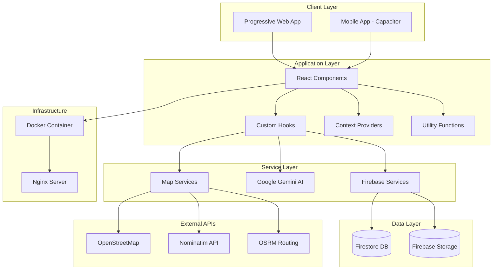
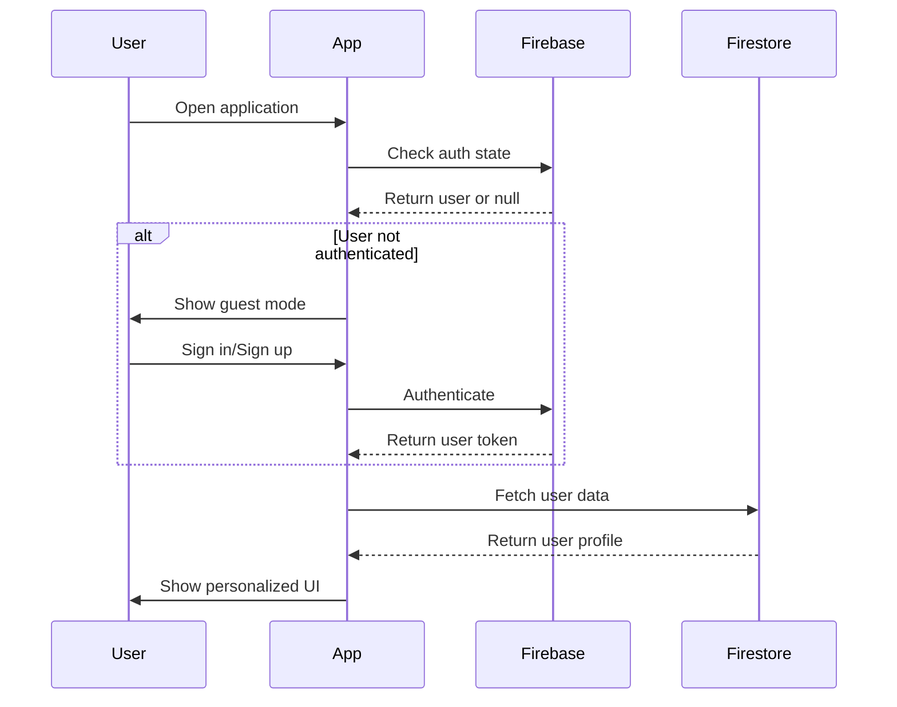
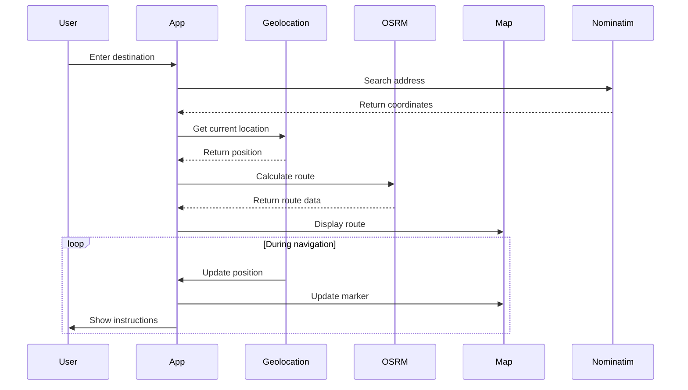
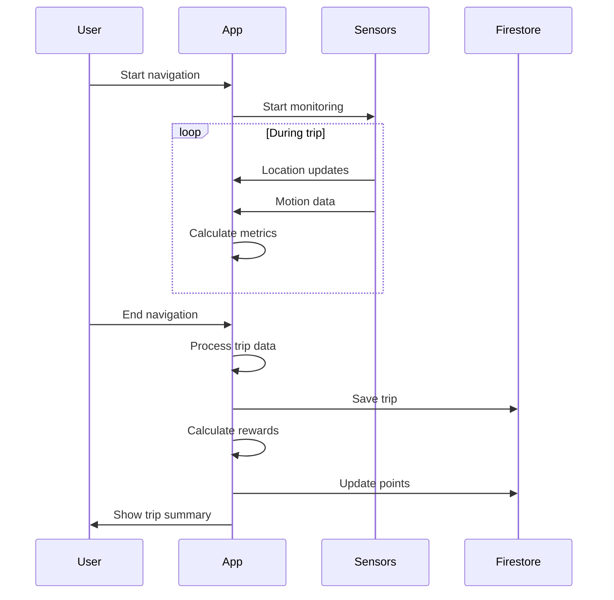
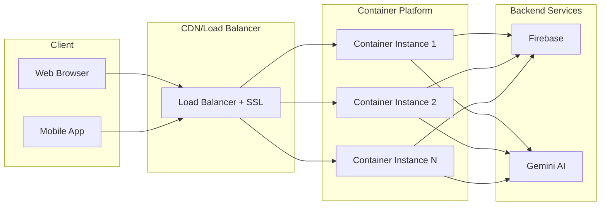
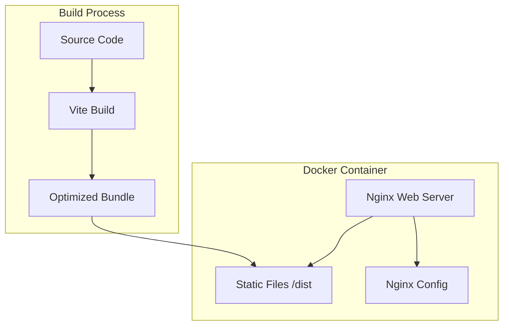

# SafeDrive Architecture

This document provides a comprehensive overview of the SafeDrive application architecture, including system design, technology stack, data flow, and scalability considerations.

## Table of Contents

- [System Overview](#system-overview)
- [Technology Stack](#technology-stack)
- [Architecture Diagram](#architecture-diagram)
- [Component Breakdown](#component-breakdown)
- [Data Flow](#data-flow)
- [Security Architecture](#security-architecture)
- [Deployment Architecture](#deployment-architecture)
- [Scalability Considerations](#scalability-considerations)

## System Overview

SafeDrive is a Progressive Web Application (PWA) that provides intelligent navigation with a focus on promoting safer driving habits through real-time analytics and a rewards system. The application is built as a client-side React application with Firebase backend services and AI-powered features using Google Gemini.

### Key Characteristics

- **Client-Side Rendering**: React-based SPA for fast, responsive UI
- **Progressive Web App**: Installable, offline-capable, mobile-first
- **Containerized**: Docker-based deployment for consistency across environments
- **Cloud-Native**: Designed for serverless and container platforms
- **Real-Time**: Live location tracking and route updates
- **AI-Powered**: Intelligent chat support and driving analytics

## Technology Stack

### Frontend

| Technology | Purpose | Version |
|------------|---------|---------|
| **React** | UI framework | 18.2.0 |
| **TypeScript** | Type-safe development | 5.2.2 |
| **Vite** | Build tool and dev server | 5.2.0 |
| **Tailwind CSS** | Utility-first styling | 3.4.3 |
| **Leaflet.js** | Interactive maps | Latest |
| **Capacitor** | Native mobile capabilities | 6.0.0 |

### Backend Services

| Service | Purpose |
|---------|---------|
| **Firebase Auth** | User authentication |
| **Firestore** | NoSQL database for user data, trips, circles |
| **Firebase Storage** | File storage for user assets |
| **Google Gemini AI** | AI-powered chat support |

### APIs and Services

| API | Purpose |
|-----|---------|
| **OpenStreetMap** | Map tiles and geocoding |
| **Nominatim** | Address search and reverse geocoding |
| **OSRM** | Route calculation and navigation |
| **Geolocation API** | Real-time location tracking |

### Infrastructure

| Component | Purpose |
|-----------|---------|
| **Docker** | Containerization |
| **Nginx** | Web server and reverse proxy |
| **Docker Compose** | Multi-container orchestration |

## Architecture Diagram

## Component Breakdown

### 1. Screens

Main application screens that represent full-page views:

- **HomeScreen**: Main navigation interface with map view
- **ProfileScreen**: User profile and statistics
- **RewardsScreen**: Points and rewards management
- **TripsScreen**: Trip history and analytics
- **SafetyCircleScreen**: Family/group safety features
- **SupportScreen**: Help and chat support

### 2. Components

Reusable UI components organized by functionality:

#### Navigation Components
- `MapView`: Leaflet-based interactive map
- `NavigationInput`: Search and route input
- `GooglePlacesInput`: Address autocomplete
- `SavedPlaces`: Home/Work quick access
- `RecenterFab`: Map re-centering button

#### Trip Components
- `TripSummaryCard`: Trip overview display
- `TripDetailModal`: Detailed trip analytics
- `LogbookModal`: Trip history viewer
- `Speedometer`: Real-time speed display
- `SpiderGraph`: Multi-metric visualization

#### Safety Components
- `DriverVerification`: Multi-modal verification system
- `HandheldPlacementCheck`: Phone placement detection
- `SetupSelectionModal`: Initial setup wizard
- `WarningToast`: Safety alerts

#### Social Components
- `SafetyCircleModal`: Circle management
- `CircleDetailModal`: Circle member details
- `CreateCircleModal`: New circle creation

#### Gamification Components
- `GarageModal`: Vehicle management
- `StatCard`: Metric display cards
- `FasterRoutePrompt`: Route optimization suggestions

#### User Management
- `GuestInfoModal`: Guest user information
- `GuestUpgradeModal`: Account upgrade prompts
- `SubscriptionModal`: Premium features

### 3. Hooks

Custom React hooks for business logic:

- `useAuth`: Authentication state management
- `useGeolocation`: Real-time location tracking
- `useNavigation`: Route calculation and guidance
- `useTrips`: Trip recording and analytics
- `useRewards`: Points and rewards logic
- `useSafetyCircle`: Circle management
- `useChat`: AI chat integration

### 4. Utils

Utility modules for specific functionality:

- `firebase.ts`: Firebase initialization
- `config.ts`: Application configuration
- `mockAuth.ts`: Authentication helpers
- `osm.ts`: OpenStreetMap integration
- `geometry.ts`: Geospatial calculations
- `smoothing.ts`: Route smoothing algorithms
- `sync.ts`: Data synchronization
- `userRepository.ts`: User data management
- `circleRepository.ts`: Circle data management
- `challengeProcessor.ts`: Challenge logic
- `mapLoader.ts`: Dynamic map loading
- `weather.ts`: Weather integration
- `helpers.ts`: General utilities

### 5. Context

React Context providers for global state:

- `AuthContext`: User authentication state
- Additional contexts as needed

## Data Flow

### 1. User Authentication Flow

### 2. Navigation Flow

### 3. Trip Recording Flow

## Security Architecture

### 1. Authentication & Authorization

- **Firebase Authentication**: Secure user authentication with multiple providers
- **Token-based**: JWT tokens for API requests
- **Role-based access**: User roles for feature access control

### 2. Data Security

- **Firestore Security Rules**: Server-side data validation
- **Client-side validation**: Input sanitization
- **HTTPS only**: All communications encrypted in transit
- **Environment variables**: Sensitive data not in code

### 3. Application Security

- **Content Security Policy**: Strict CSP headers in nginx
- **XSS Protection**: React's built-in XSS prevention
- **CSRF Protection**: Token-based requests
- **Secure headers**: X-Frame-Options, X-Content-Type-Options, etc.

### 4. Container Security

- **Read-only filesystem**: Container runs with read-only root
- **Non-root user**: Nginx runs as non-privileged user
- **Minimal base image**: Alpine Linux for smaller attack surface
- **No secrets in image**: Environment variables for sensitive data

## Deployment Architecture

### Production Deployment

### Container Architecture

## Scalability Considerations

### Horizontal Scaling

- **Stateless design**: No server-side session state
- **Container-based**: Easy to scale with orchestration platforms
- **Load balancing**: Distribute traffic across instances
- **Auto-scaling**: Cloud platform auto-scaling based on metrics

### Performance Optimization

1. **Frontend Optimization**
   - Code splitting with React.lazy
   - Tree shaking with Vite
   - Asset optimization (minification, compression)
   - Service worker for offline caching

2. **Network Optimization**
   - Gzip compression (configured in nginx)
   - Long-term caching for static assets
   - CDN for global distribution
   - HTTP/2 support

3. **Database Optimization**
   - Firestore indexes for common queries
   - Pagination for large datasets
   - Offline persistence with Firestore cache

### Monitoring and Observability

- **Health checks**: `/health` endpoint for container orchestration
- **Logging**: Structured logs to stdout/stderr
- **Metrics**: Container resource usage
- **Error tracking**: Client-side error reporting
- **Analytics**: User behavior and performance metrics

## Future Enhancements

### Planned Improvements

1. **Microservices Architecture**: Separate backend services for specific features
2. **GraphQL API**: More efficient data fetching
3. **Real-time Updates**: WebSocket for live features
4. **Edge Computing**: Process data closer to users
5. **Machine Learning**: On-device ML for driving analytics

### Scalability Roadmap

1. **Phase 1**: Current architecture (up to 10K users)
2. **Phase 2**: Add caching layer (up to 100K users)
3. **Phase 3**: Microservices + API gateway (up to 1M users)
4. **Phase 4**: Multi-region deployment (global scale)

---

For more information, see:
- [README.md](README.md) - Project overview
- [DEPLOYMENT.md](DEPLOYMENT.md) - Deployment instructions
- [CONTRIBUTING.md](CONTRIBUTING.md) - Development guidelines
